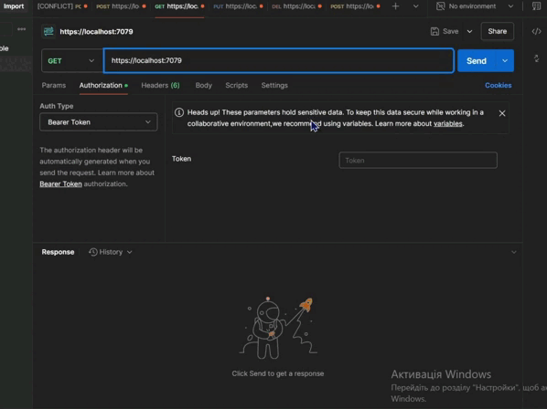

# ShopItems-API

### About project
Users can't make CRUD operations until they authorithed. Only admin have access to POST, PUT and DELETE operations. 
Even if you simply want to GET information, you still have to be authorized, but you don't have to be an admin for that. 

### How it works with Postman

### NuGet Packages
For JWT Bearer (Token Autherization):
- Microsoft.AspNetCore.Authentication.JwtBearer
- Microsoft.IdentityModel.Tokens
- System.IdentityModel.Tokens.Jwt 

For MySQL Database:
- MySql.Data
- Dapper

In case you interested in data access realisation with help of EntityFramework, I have [REST API project](https://github.com/teafr/Books-API)  with usage of this package.

### Additional technical Information
This is ASP.NET Core Empty project. 
You could guess that in this project I used Database to store all items and manipulate with them. I used my own library, which I often connect to my projects. 
Class Libraries are really beneficial, because you can create main logic once and reuse it for different projects even if they have different project types.
